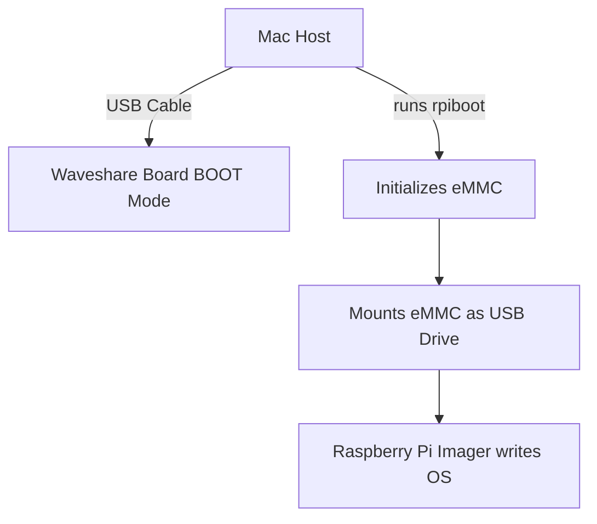

# Raspberry Pi CM4 End-to-End Setup Guide: From Flashing to WebRTC Streaming

This document provides the complete end-to-end process for setting up a new Raspberry Pi Compute Module 4 (CM4) with eMMC storage, starting from the initial OS flashing on macOS, all the way to deploying the LiveKit WebRTC video streaming service.

---

## Part 1: Flashing the OS onto the CM4 eMMC (macOS Host)

Because CM4 modules with onboard eMMC do not mount automatically like standard USB drives, we must use the `rpiboot` tool to expose the storage to the host Mac.

### Prerequisites
- Raspberry Pi CM4 with eMMC storage
- Waveshare CM4 IO/Extension Board
- USB-C/Micro-USB cable capable of data transfer
- Power supply for the Waveshare board
- Host Mac with `usbboot` (`rpiboot`) and **Raspberry Pi Imager** installed

### Technical Workflow



### Step 1: Hardware Configuration (Boot Mode)
To allow the host computer to access the eMMC storage, the CM4 must be forced into USB boot mode.
1. Locate the **BOOT** or **nRPI_BOOT** switch/jumper on the Waveshare expansion board.
2. Set the switch to **ON** (or short the pins with a jumper cap).
3. Insert the CM4 module firmly into the expansion board slots.
4. Connect the data cable from your Mac to the **USB SLAVE** (or Type-C) port on the Waveshare board.
5. Connect the power supply to the Waveshare board and turn it on.

### Step 2: Mounting the eMMC File System
1. Open the macOS Terminal.
2. Navigate to your local usbboot directory: `cd ~/usbboot`
3. Execute the utility with root privileges: `sudo ./rpiboot`
4. **System Notification:** macOS may display a warning stating *"The disk you inserted was not readable by this computer."* **Ignore this warning** and do not click initialize. The drive is now exposed.

### Step 3: Flashing the Operating System
1. Launch the **Raspberry Pi Imager**.
2. Click **Choose OS** and select your desired OS (e.g., Raspberry Pi OS Debian 13 / Trixie).
3. Click **Choose Storage** and select the mounted CM4 eMMC drive.
4. *(Optional)* Click the Settings Gear Icon to pre-configure hostnames, SSH access, user credentials (e.g., user `test3`), and Wi-Fi.
5. Click **Write**.
6. Wait for the writing and verification processes to complete.

### Step 4: Post-Flashing & Normal Boot
1. Power off the Waveshare expansion board completely.
2. Disconnect the USB cable connecting the board to your Mac.
3. **CRITICAL:** Toggle the BOOT switch back to **OFF**. *(Failure to do this will cause the board to hang on a blank screen on boot).*
4. Apply power. The CM4 will now boot into the new OS. SSH into your newly flashed Pi.

---

## Part 2: WebRTC Streaming Setup

Once your Pi is booted and you are SSH'd into it (e.g., `test3@test3`), you need to prepare it for the LiveKit WebRTC publisher.

### Step 1: Install System and Python Dependencies
The streaming script relies on OpenCV and the LiveKit Python SDK. Run the following to install the necessary packages and the `pip3` package manager:

```bash
sudo apt update
sudo apt install -y python3-opencv python3-pip
pip3 install livekit requests --break-system-packages
```

### Step 2: Set Up the Project Directory
Create a dedicated folder for the project and move the publisher script into it:

```bash
mkdir -p ~/webrtc
cd ~/webrtc
```
*(Make sure `lk-publisher.py` is copied from your Mac into this `~/webrtc` folder on the Pi).*

### Step 3: Configure the Systemd Autostart Service
To ensure the Pi starts streaming the moment it powers on without requiring manual SSH intervention, we set up a Linux system service. 

**Important:** Make sure to replace `test3` with your actual Linux username, and adjust the `DEVICE_ID` to be unique for this specific Pi (e.g., `pi-patient-02`).

Run this entire block on the Pi:

```bash
sudo bash -c 'cat <<EOF > /etc/systemd/system/webrtc-stream.service
[Unit]
Description=LiveKit WebRTC Publisher
After=network-online.target
Wants=network-online.target

[Service]
Type=simple
User=test3
WorkingDirectory=/home/test3/webrtc
Environment="BACKEND_URL=https://vid1.clinohealthinnovation.com"
Environment="LIVEKIT_URL=wss://livekit.clinohealthinnovation.com"
Environment="DEVICE_ID=pi-patient-02"
Environment="FPS=25"

# Apply anti-flicker (50Hz) to the camera right before starting
ExecStartPre=-/usr/bin/v4l2-ctl -d /dev/video0 --set-ctrl=power_line_frequency=1

ExecStart=/usr/bin/python3 /home/test3/webrtc/lk-publisher.py
Restart=always
RestartSec=10

[Install]
WantedBy=multi-user.target
EOF'
```

### Step 4: Enable and Start the Stream
Reload the system daemon to recognize the new service, enable it on boot, and start it immediately:

```bash
sudo systemctl daemon-reload
sudo systemctl enable webrtc-stream
sudo systemctl start webrtc-stream
```

### Step 5: Verification & Troubleshooting
Check the status of the stream:
```bash
sudo systemctl status webrtc-stream
```
If it says `active (running)`, your camera is actively streaming to the backend!

**View Live Logs:**
To see the Python script's live output or debug errors (like missing modules or connection issues):
```bash
sudo journalctl -u webrtc-stream -n 50 -f
```

---

## Flash Troubleshooting Reference

| Symptom | Potential Cause | Resolution |
|---------|----------------|------------|
| `rpiboot` stuck on Waiting for BCM2835... | Incorrect switch position or faulty cable | Double-check BOOT switch is ON. Ensure USB cable supports data transfer. Try different USB port. |
| Target drive not showing up in Pi Imager | `rpiboot` not executed or failed | Re-run `sudo ./rpiboot` in terminal and ensure it succeeds before opening Imager. |
| Board won't boot into OS after flashing | BOOT jumper/switch is still enabled | Turn off power, switch BOOT to OFF, and power back on. |
